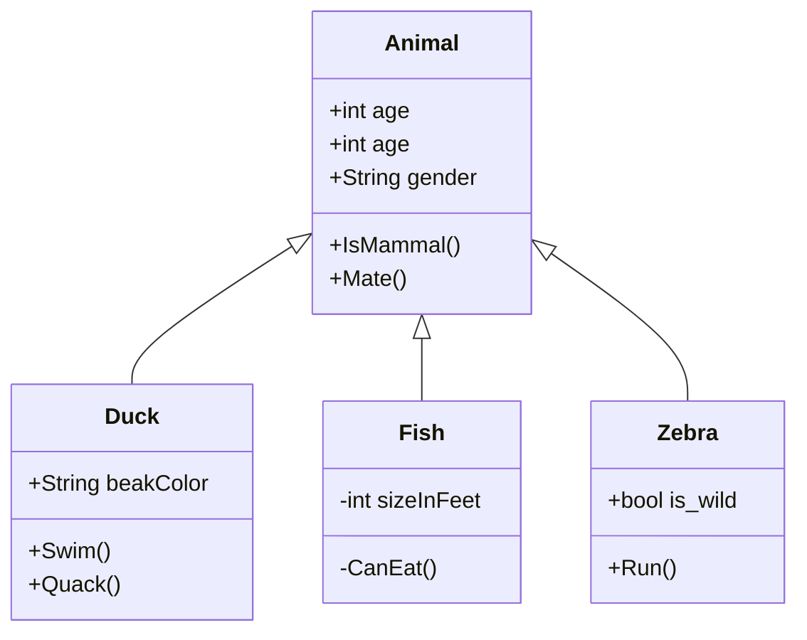
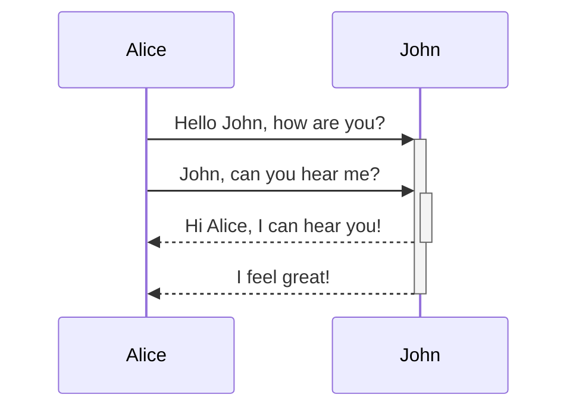

# assignment-03

## animal diagram

```mermaid
classDiagram
Animal <|-- Duck
Animal <|-- Fish
Animal <|-- Zebra
Animal : +int age
Animal : +int age
Animal : +String gender
Animal : +IsMammal()
Animal : +Mate()
class Duck{
    +String beakColor
    +Swim()
    +Quack()
}
class Fish{
    -int sizeInFeet
    -CanEat()
}
class Zebra{
    +bool is_wild
    +Run()
}
```

```mermaid
sequenceDiagram
    Alice->>+John: Hello John, how are you?
    Alice->>+John: John, can you hear me?
    John-->>-Alice: Hi Alice, I can hear you!
    John-->>-Alice: I feel great!
```

```mermaid
sequenceDiagram

```